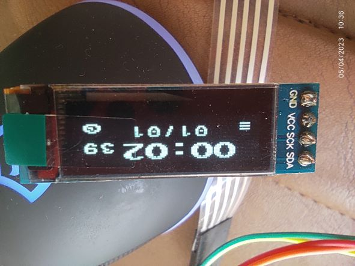
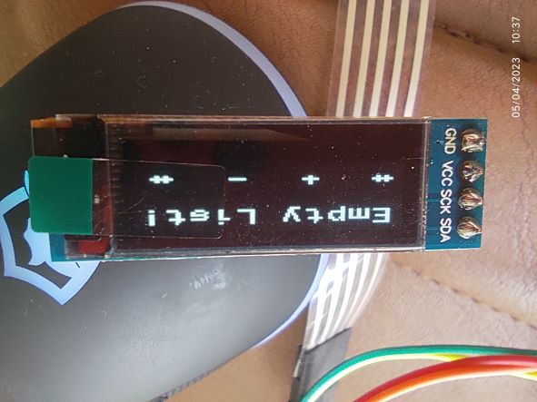
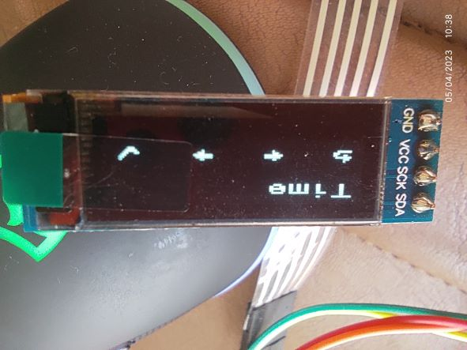

## Timer
I work on this project whenever I find some spare time.

#### Description
A cheap multi-purpose timer that supports Monthly / Weekly / Daily schedules for toggling 1 output (4 for the future). `STM32CubeMX` file included in the repository.

I use the <a href="https://github.com/4ilo/ssd1306-stm32HAL" target="_blank">ssd1306-stm32HAL</a> library and <a href="https://github.com/the-this-pointer/glcd-font-calculator" target="_blank">glcd-font-calculator</a> for creating custom char icons for my SSD1306 LCD. (see `Icon11x18` in `Core/Src/fonts.c`)

You can access the KiCAD PCB design files <a href="https://github.com/the-this-pointer/timer-board-stm32f103-hw-2" target="_blank">here</a>.

#### Images:
Main screen:

Time list screen:

Time setting screen:

#### Todo:

- Toggle schedules for several hours or minutes (times less than a day).
- Add three more outputs to increase the board functionality.
